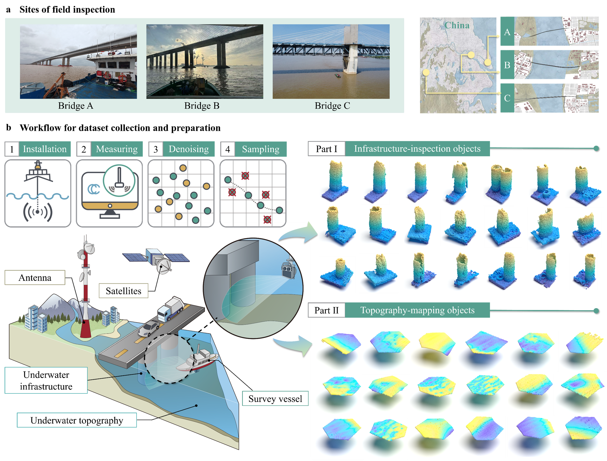

# USPCDenoise Dataset

> **Anonymous version for reviewers**

## Overview
**USPCDenoise** is an open-source dataset specifically designed for underwater sonar point cloud denoising.  
A significant challenge in underwater infrastructure inspection is the lack of publicly available sonar point cloud datasets. To fill this gap, we collected and processed real 3D sonar measurements, creating a benchmark dataset that supports both research and practical applications in underwater environments.  

      
    <em> Schematic Diagram of Data Acquisition and Dataset Construction. (a) Field measurement site. (b) Workflow of data collection and dataset construction. </em>

The dataset includes representative measurement objects covering:
- **Mapping targets:** underwater terrain
- **Inspection targets:** underwater structures

This design ensures that the dataset is not only suitable for this study but also broadly applicable to general underwater sonar denoising tasks.

---

## Dataset Composition
The dataset consists of **639 point clouds** divided into two categories:  

- **Foundation point clouds (inspection targets):**  
  - **173 samples**, each containing **2,048 points**  
  - Organized into two HDF5 files:  
    - `train_val_unsupervised.h5` – training data/validation data 
    - `test_unsupervised.h5` – testing data  

- **Terrain point clouds (mapping targets):**  
  - **466 samples**, each containing **3,072 points**  
  - Organized into two HDF5 files:  
    - `train_val_data.h5` – training data/validation data  
    - `test_data.h5` – testing data

Each `.h5` file stores point clouds in a structured format for easy integration with deep learning frameworks such as **PyTorch** and **TensorFlow**.

---

## Key Features
- Real 3D sonar measurements  
- Covers both **underwater structures** and **terrain surfaces**  
- Suitable for tasks including:
  - Point cloud denoising
  - 3D reconstruction
  - Underwater target recognition
  - Structural safety analysis and scour morphology prediction  

---

## Applications
USPCDenoise fills an important gap in publicly available underwater 3D sonar point cloud resources.  
It serves as a **benchmark dataset** for advancing research in:
- Computer vision  
- Artificial intelligence  
- Civil engineering  
- Marine surveying and archaeology  

